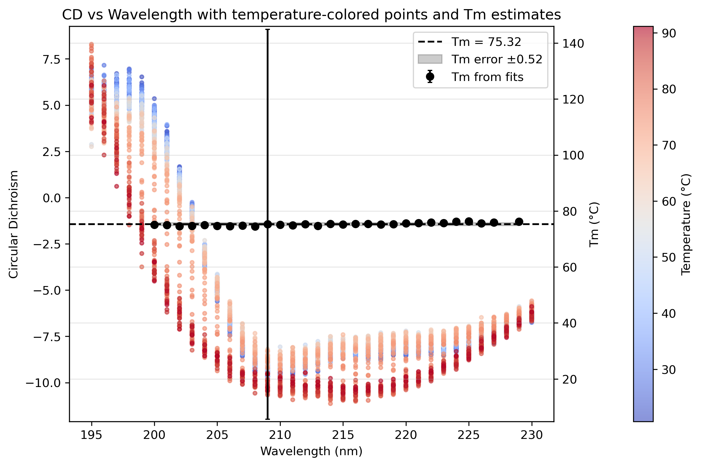

# Protein Biophysics: Automated Circular Dichroism (CD) Data Pipelines

This repository contains automated Python workflows designed to process, analyze, and visualize Circular Dichroism (CD) spectroscopic data. The pipelines handle both standalone spectrum analysis and multi-dimensional temperature scan datasets to evaluate protein secondary structure and thermal stability ($T_m$).

Developed as an integrated solution to replace manual Excel-based processing for biophysical laboratory data at TU Graz.

## Scientific Background

Circular Dichroism (CD) spectroscopy is a widely used technique for studying protein secondary structure and conformational stability. By monitoring changes in the CD signal across wavelengths and temperatures, it is possible to characterize structural transitions and estimate the protein melting temperature ($T_m$), an important indicator of thermal stability.

This project provides automated and reproducible workflows for processing CD spectra and temperature-dependent unfolding experiments using Python.

## 🚀 Key Features

### 1. Single Spectrum Processing (`CD_analysis_spectra.ipynb`)

* **Signal Noise Reduction:** Implements `scipy.signal.savgol_filter` (Savitzky–Golay) to smooth raw experimental curves.
* **Baseline Correction:** Automated subtraction of buffer control baselines.
* **Standardization:** Converts raw machine ellipticity (mdeg) into Mean Residue Ellipticity (MRE, $\text{deg}\cdot\text{cm}^2\cdot\text{dmol}^{-1}$) utilizing protein concentration, molecular weight, and path length.

### 2. Multi-Wavelength Temperature Scan & Fitting (`CD_analysis_tempscan.ipynb`)

* **Data Aggregation:** Dynamically loads and groups wavelength-specific temperature scan files.
* **Multidimensional Data Handling:** Leverages `xarray` to build and manipulate a 2D dataset matrix (Temperature × Wavelength).
* **Quality Control & Filtering:** Implements an automated high-noise data filter based on an instrumental Absorbance threshold ($\leq 2$).
* **Thermostability Profiling:** Extracts protein melting temperatures ($T_m$) using multi-wavelength non-linear regression models (`scipy.optimize`).

## 🛠️ Tech Stack & Libraries

* **Language:** Python 3
* **Data Manipulation:** `pandas`, `numpy`, `xarray`
* **Signal Processing & Optimization:** `scipy` (`signal`, `optimize`)
* **Data Visualization:** `matplotlib`

## 📂 Repository Structure

* `CD_analysis_spectra.ipynb` — Jupyter notebook for standalone spectrum processing.
* `CD_analysis_tempscan.ipynb` — Jupyter notebook for multi-wavelength temperature scans.
* `figures/` — Images and plots used in project documentation.
* `README.md` — Project documentation.

## 📈 Impact & Application

These workflows automate routine CD data processing tasks, improve reproducibility, and facilitate efficient extraction of thermodynamic parameters such as melting temperature ($T_m$). The resulting visualizations support interpretation of protein structural changes and thermal stability experiments.

## Representative Results

### Circular Dichroism Analysis

The figure below shows CD spectra collected across a temperature range from approximately 25°C to 90°C. The color scale represents temperature, allowing visualization of temperature-dependent structural changes in the protein.

